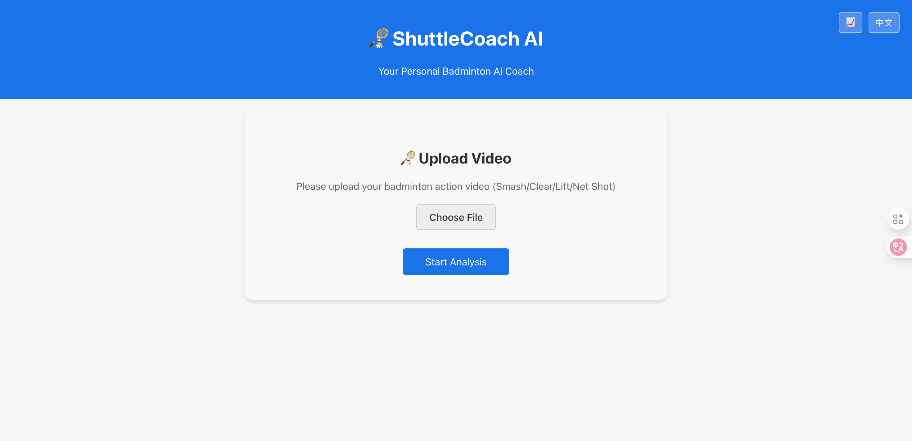
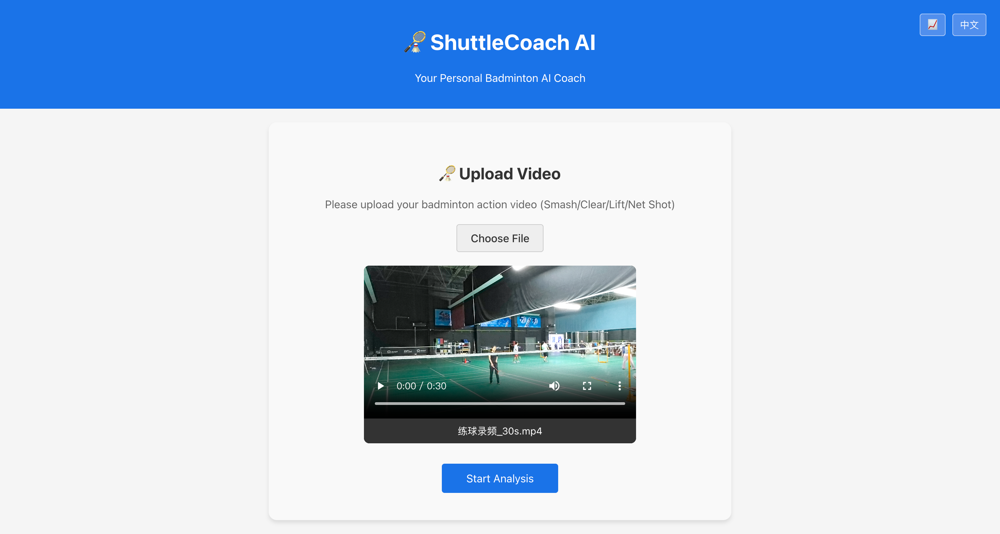
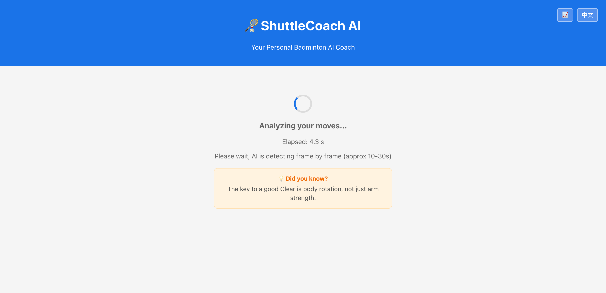
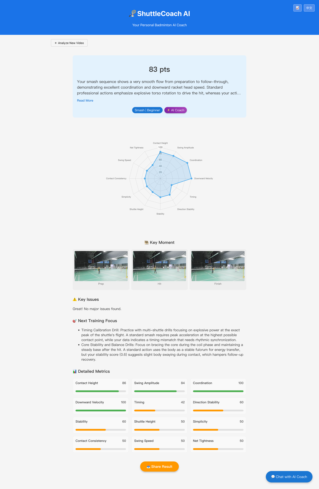
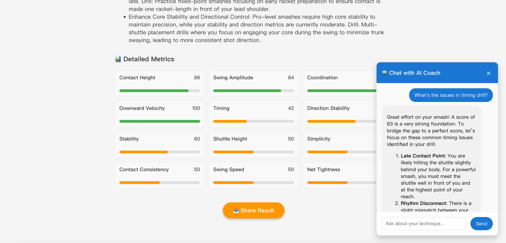
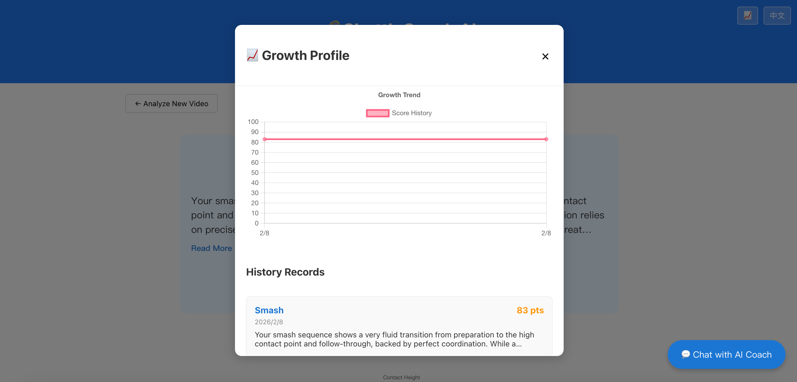
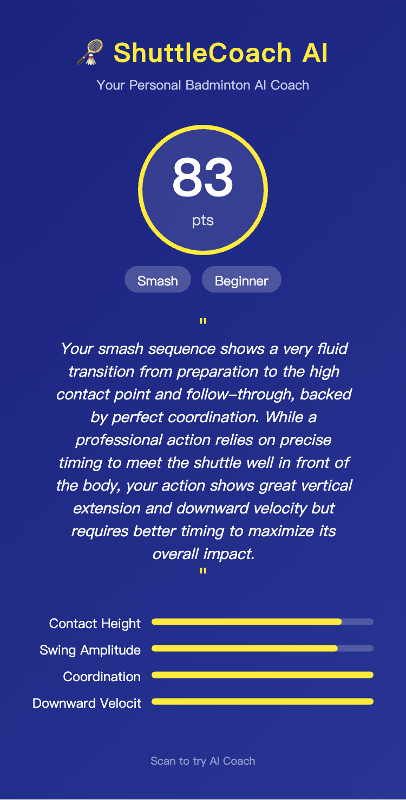

# 🏸 ShuttleCoach AI

> **您的私人羽毛球 AI 教练**  
> _Powered by Gemini 3 & MediaPipe_

[](https://opensource.org/licenses/MIT)
[](https://deepmind.google/technologies/gemini/)
[](https://reactjs.org/)
[](https://fastapi.tiangolo.com/)

[English Docs](./README.md) | [在线演示](https://youtu.be/RRDhoylC7d4)

---

## 📖 项目简介

**ShuttleCoach AI** 是一款专为羽毛球爱好者（新手至进阶）设计的智能分析应用。它结合了先进的计算机视觉（CV）和大语言模型（LLM）技术，能够对您的羽毛球训练视频进行深度识别，提供客观评分、技术诊断以及可执行的改进建议。

不同于只提供冷冰冰数据的工具，ShuttleCoach AI 就像一位真实的教练，为您提供详尽的反馈和互动指导。

## 🚀 为什么选择 Gemini 3？

ShuttleCoach AI 充分发挥了 **Gemini 3** 的前沿能力，打破了传统数据图表的局限，提供了真正“类人化”的执教体验：

1.  **深度多模态理解**：不同于基础的 CV 模型，Gemini 3 能够分析动作的**时序序列**。通过同时处理“引拍、击球、随挥”三个关键帧，它能理解生物力学上的“动作流”，精准定位发力链条中的断点。
2.  **复杂推理与标准对比**：Gemini 3 将原始的骨骼关键点数据与其庞大的羽毛球专业知识库相结合，提供**“标准 vs 现状”**的深度对比。它不仅会告诉你“抬高击球点”，还会解释为什么你当前的动作角度限制了力量爆发。
3.  **上下文感知交互**：通过**交互式 AI 教练**，Gemini 3 能够维持当前分析的完整上下文。它可以处理细致的追问，并根据视频中检测出的具体缺陷，为您量身定制训练方案。
4.  **极具指导性的反馈合成**：它将冰冷的生物力学指标转化为客观、理性且富有鼓励性的“教练人话”，确保每一条建议对学员下一次上场都具有即时可执行性。

## ✨ 核心功能

*   **🎬 自动化动作识别**：自动检测并分类杀球、高远球、挑球、放网等动作，基于 MediaPipe Pose 提取关键点。
*   **📊 动态时序分析 (由 Gemini 3 驱动)**：多模态分析动作全流程：**引拍 -> 击球点 -> 随挥**，识别运动链条深度问题。
*   **🤖 交互式 AI 教练 (由 Gemini 3 驱动)**：个性化对话体验。提问如“为什么我杀球压不住？”，实时获得基于数据的专业纠错。
*   **📈 成长档案**：记录您的训练历史，通过趋势图直观展示技术成长轨迹。
*   **🖼️ 社交分享**：一键生成精美的成绩分享卡片，方便在社交媒体展示您的训练成果。
*   **📱 移动端优先**：完全响应式设计，完美适配手机屏幕，方便在球场随时使用。

## 🛠️ 技术栈

### 前端 (Frontend)
*   **框架**: React (Vite)
*   **图表**: Chart.js (雷达图 & 折线图)
*   **样式**: CSS Modules, 响应式设计
*   **工具**: html2canvas (分享卡片生成)

### 后端 (Backend)
*   **框架**: FastAPI (Python)
*   **CV 引擎**: MediaPipe Pose (骨骼关键点提取), OpenCV
*   **AI 引擎**: Google Gemini 3 API (多模态分析)
*   **数据库**: SQLite (轻量级任务存储)

## 🚀 快速开始

### 前置要求
*   Node.js (v16+)
*   Python (v3.9+)
*   Google Gemini API Key

### 安装步骤

1.  **克隆项目**
    ```bash
    git clone https://github.com/zyx850525/ShuttleCoachAI.git
    cd ShuttleCoachAI
    ```

2.  **后端配置**
    ```bash
    cd backend
    python -m venv venv
    source venv/bin/activate  # Windows 用户使用: venv\Scripts\activate
    pip install -r requirements.txt
    ```

3.  **环境变量配置**
    在根目录下创建 `.env` 文件：
    ```env
    GEMINI_API_KEY=your_api_key_here
    # GEMINI_PROXY=http://127.0.0.1:7890 (可选，如需代理)
    ```

4.  **前端配置**
    ```bash
    cd frontend
    npm install
    ```

### 运行项目

1.  **启动后端**
    ```bash
    cd ShuttleCoachAI
    uvicorn backend.main:app --reload
    ```

2.  **启动前端**
    ```bash
    cd frontend && npm run dev
    ```

3.  浏览器访问 `http://localhost:5173`。

## 📸 截图展示

### 1. 首页与视频上传
简洁直观的首页，用户可以直接上传训练视频。


### 2. 准备分析
视频上传后，系统将进行质量检测，并准备进入深度的生物力学分析逻辑。


### 3. AI 分析中
AI 引擎（MediaPipe + Gemini 3）实时提取动作链关键指标。


### 4. 详尽的分析结果
核心价值页面，展示得分、指标雷达图、识别出的技术问题及 AI 深度建议。


### 5. 交互式 AI 教练 (Gemini 3)
基于您当前的动作视频，与私人教练进行深度对话，获取针对性建议。


### 6. 成长档案
记录您的技术成长轨迹，直观展示历史得分趋势。


### 7. 社交分享卡片
一键生成高分辨率的分析汇总卡片，方便发送给好友或分享到社交平台。


## 🤝 贡献指南

欢迎提交 Issue 和 Pull Request！

## 🗺️ 后续优化方向
*   **3D 动作重构**：从 2D 骨骼关键点进化到 3D 骨骼轨迹分析，提供更高维度的动作理解。
*   **多视角权重优化**：针对不同拍摄视角（侧位、后位）建立特定的评分权重体系。
*   **实战全程分析**：从分析单一动作进化到对整场比赛的跑位协调性及战术执行力进行评估。
*   **社交激励体系**：引入社区排名与好友对战，增加产品在羽毛球圈内的社交粘度。

## 📄 开源协议

本项目基于 MIT License 开源 - 详情见 [LICENSE](LICENSE) 文件。
